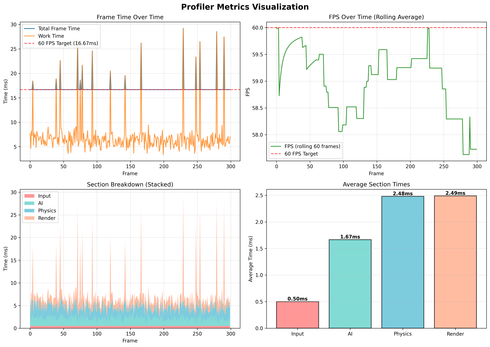

# C++ Game Profiler / Telemetry Tool

A lightweight, console-based C++ profiling and telemetry tool designed for game/engine development. This project demonstrates understanding of frame timing, RAII patterns, rolling statistics, and clean tool-style code organization.

## Features

- **Frame Timing**: Per-frame timing with work time vs total frame time tracking
- **Section Profiling**: Named section timing (Input, AI, Physics, Render) using RAII-based scoped timers
- **Rolling Statistics**: 
  - Rolling averages over a configurable window (default: 30 frames)
  - Worst-frame tracking (both within window and overall lifetime)
  - O(1) average calculation using running sums
- **Ring Buffer**: Efficient circular buffer implementation for frame history
- **CSV Export**: Continuous export of frame data for analysis
- **Visualization**: Python script to generate comprehensive performance graphs

## Project Structure

```
Profiler/
├── src/
│   └── main.cpp              # Main game loop simulation
├── profiler/
│   ├── FrameStats.h          # Frame statistics tracker (header)
│   ├── FrameStats.cpp        # Frame statistics implementation
│   ├── ScopedTimer.h         # RAII-based section timer (header)
│   └── ScopedTimer.cpp       # ScopedTimer implementation
├── frame_stats.csv           # Exported frame data (generated)
├── profiler_metrics.png      # Visualization output (generated)
├── visualize.py              # Python script for data visualization
└── README.md                 # This file
```

## Building

### Requirements
- MSVC (Microsoft Visual C++ Compiler)
- C++17 or later
- Python 3.x with pandas, matplotlib, numpy (for visualization)

### Compilation

Open **Developer Command Prompt for VS** and run:

```cmd
cd D:\Projects\C++\Profiler
cl.exe /EHsc /std:c++17 /I. src\main.cpp profiler\FrameStats.cpp profiler\ScopedTimer.cpp /Fe:src\main.exe /Fo:src\
```

Or use the one-liner:
```cmd
cl.exe /EHsc /std:c++17 /I. src\main.cpp profiler\FrameStats.cpp profiler\ScopedTimer.cpp /Fe:src\main.exe /Fo:src\ && src\main.exe
```

## Usage

### Running the Profiler

```cmd
src\main.exe
```

The profiler simulates a game loop running at ~60 FPS with:
- Variable workload per frame (2-8ms normally, 12-25ms spikes)
- Four sections: Input, AI, Physics, Render
- Frame timing capped at 16.67ms using spin-wait

### Output

The profiler outputs:
- **Console**: Frame statistics every 30 frames showing:
  - Window average frame time and FPS
  - Worst frame in rolling window (with section breakdown)
  - Worst frame overall (with section breakdown)
- **CSV File**: `frame_stats.csv` with columns:
  - Frame, Work(ms), Total(ms), Input(ms), AI(ms), Physics(ms), Render(ms)

### Visualization

Generate performance graphs:

```cmd
pip install pandas matplotlib numpy
python visualize.py
```

This creates `profiler_metrics.png` with 4 charts:
1. **Frame Time Over Time** - Total vs Work time with 60 FPS target
2. **FPS Over Time** - Rolling average FPS (60-frame window)
3. **Section Breakdown** - Stacked area chart showing section contributions
4. **Section Averages** - Bar chart comparing average section times



The script also prints summary statistics to the console:
- Total frames processed
- Average frame time and FPS
- Min/Max frame times
- Average time per section (Input, AI, Physics, Render)

## Key Concepts Demonstrated

### RAII (Resource Acquisition Is Initialization)
- `ScopedTimer` automatically starts timing in constructor and stops in destructor
- Exception-safe: timing is recorded even if code throws
- Clean scoped-based API

### Rolling Statistics
- Ring buffer implementation for O(1) frame storage
- Running sums for O(1) average calculation
- Worst-frame tracking with deep copying to preserve data

### Modern C++ Practices
- C++17 features
- Move semantics (`std::move` for section data)
- Const correctness
- Clean separation of concerns

## Example Output

```
=== Frame 0 ===
Window Avg Work Time: 5.93 ms | Window Avg Total Time: 16.67 ms | FPS: 60.00 | Window: 1/30
Worst (Window): Frame 0 = 16.67 ms
  Input     :    0.77 ms
  AI        :    2.45 ms
  Physics   :    1.95 ms
  Render    :    0.75 ms
Worst (Overall): Frame 0 = 16.67 ms
  Input     :    0.77 ms
  AI        :    2.45 ms
  Physics   :    1.95 ms
  Render    :    0.75 ms

=== Frame 30 ===
Window Avg Work Time: 6.65 ms | Window Avg Total Time: 16.67 ms | FPS: 60.00 | Window: 30/30
Worst (Window): Frame 30 = 16.67 ms
  Input     :    0.71 ms
  AI        :    0.97 ms
  Physics   :    3.35 ms
  Render    :    0.92 ms
Worst (Overall): Frame 0 = 16.67 ms
  Input     :    0.77 ms
  AI        :    2.45 ms
  Physics   :    1.95 ms
  Render    :    0.75 ms

=== Frame 60 ===
Window Avg Work Time: 8.58 ms | Window Avg Total Time: 17.77 ms | FPS: 56.28 | Window: 30/30
Worst (Window): Frame 43 = 28.69 ms
  Input     :    0.49 ms
  AI        :    1.91 ms
  Physics   :    2.40 ms
  Render    :   23.88 ms
Worst (Overall): Frame 43 = 28.69 ms
  Input     :    0.49 ms
  AI        :    1.91 ms
  Physics   :    2.40 ms
  Render    :   23.88 ms

  ...
  ...
  ...

  === Frame 299 ===
Window Avg Work Time: 7.51 ms | Window Avg Total Time: 17.34 ms | FPS: 57.66 | Window: 30/30
Worst (Window): Frame 283 = 27.45 ms
  Input     :    0.20 ms
  AI        :    1.99 ms
  Physics   :    1.92 ms
  Render    :   23.33 ms
Worst (Overall): Frame 43 = 28.69 ms
  Input     :    0.49 ms
  AI        :    1.91 ms
  Physics   :    2.40 ms
  Render    :   23.88 ms
```

## Technical Details

- **Frame Target**: 16.67ms (60 FPS)
- **Buffer Size**: 30 frames (configurable in `FrameStats.h`)
- **Work Distribution**: 
  - Input: Fixed 0.5ms
  - AI: Random 0.67-2.67ms
  - Physics: Random 1.0-4.0ms
  - Render: Random 0.67-2.67ms (with 5% chance of 12-25ms spikes)

## License

This is a portfolio project for educational/demonstration purposes.

